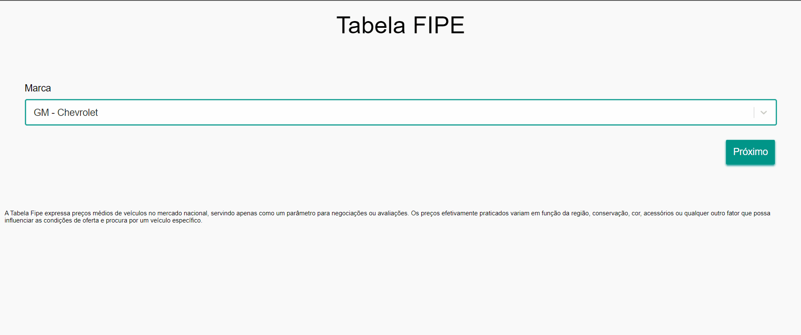

# Tabela FIPE (SPA)
SPA (Single Page Application) feita em React que auxilia na busca de preços da tabela FIPE.



## Requisitos
- Node.js versão 12+
- NPM versão 6+

## Instalação
```
git clone https://github.com/joelson-c/tabela-fipe-spa.git
cd tabela-fipe-spa
npm install
```

## Uso
Execute o comando `npm start` para iniciar o projeto em modo de desenvolvimento. Por padrão ele automaticamente irá
abrir uma nova aba no navegador padrão com o endereço do servidor local.

Para criar uma versão do projeto para produção execute `npm run build`.
Os arquivos estarão disponíveis na pasta `build`

## Testes
Para executar todos os testes utilize o comando `npm test`

## Créditos
Este projeto utiliza:
- [Create React App][1]
- [React][2]
- [Styled Components][3]
- [Jest][4]
- [Enzyme][5]

## Licença
MIT

[1]: https://github.com/facebook/create-react-app
[2]: https://github.com/facebook/react
[3]: https://github.com/styled-components/styled-components
[4]: https://github.com/facebook/jest
[5]: https://github.com/airbnb/enzyme
